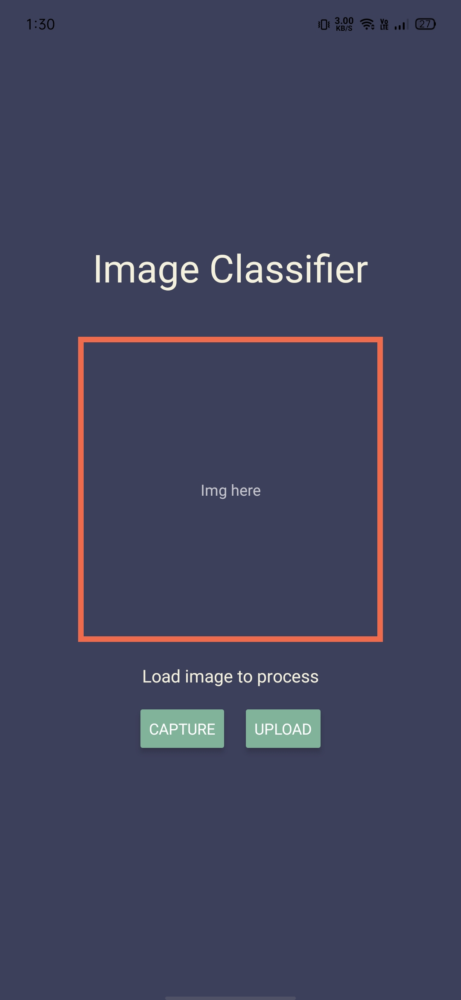
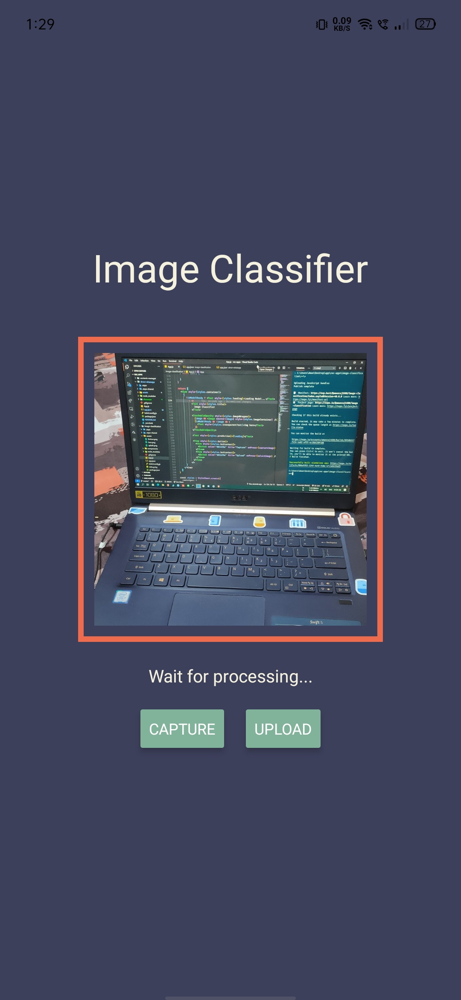
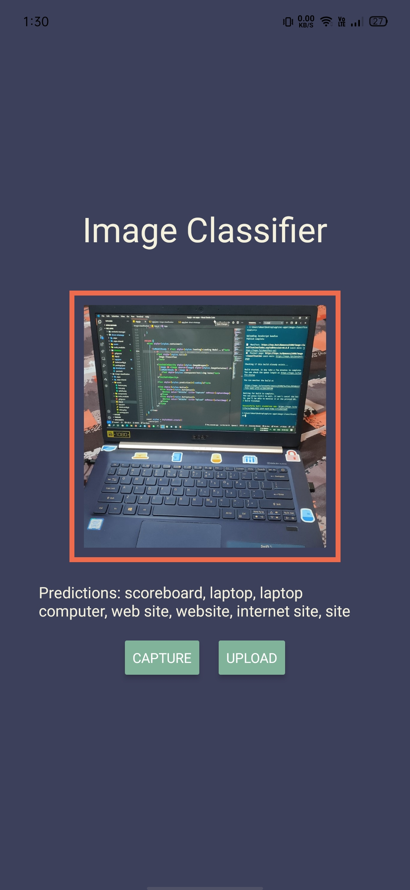
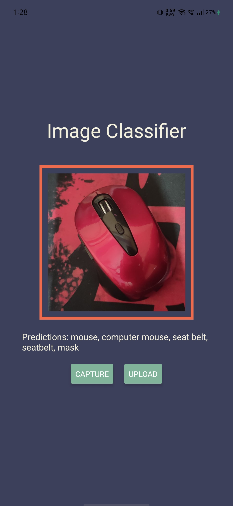

### Image Classifier

Played with tfjs. Expo + tfjs is hard to set up better to use react-native cli. After visiting many stackoverflow pages this works now.

`TensorFlow.js` pre trained models -> [tfjs](https://github.com/tensorflow/tfjs-models)

ttjs for react-native -> https://github.com/tensorflow/tfjs/tree/master/tfjs-react-native

```
@react-native-community/async-storage
@tensorflow/tfjs
@tensorflow/tfjs-react-native
@tensorflow-models/mobilenet
expo-camera
react-native-fs
expo-gl
jpeg-js
```

#### [Android Apk link](https://exp-shell-app-assets.s3.us-west-1.amazonaws.com/android/%40amanraj1608/image-classification-84e23db56faf4d1084e9e3750cc33437-signed.apk)



<br />


<br />

